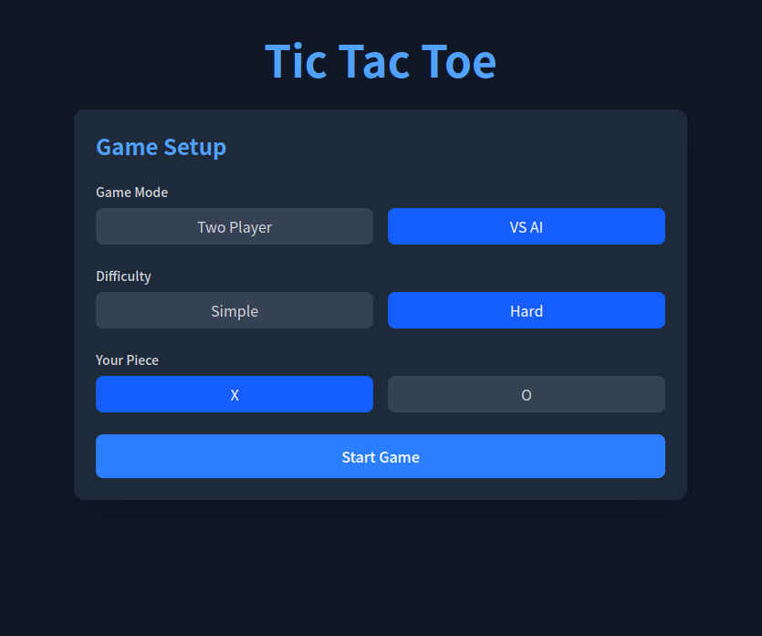
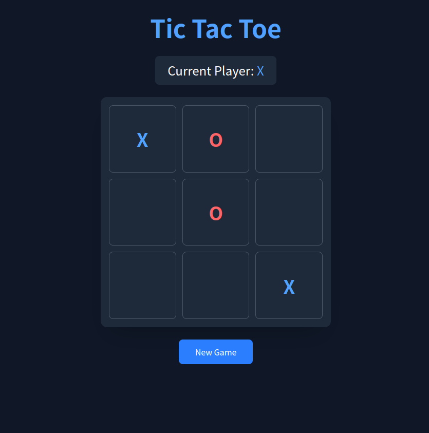

## Tic Tac Toe


A simple Tic Tac Toe game implemented in Solid.js and Tailwind CSS.

### Highlights
- A nice and clean dark UI with comfortable animations.
- Supports both desktop and mobile devices, including touch gestures.
- AI with two difficulty levels: easy (random moves) and hard (Minimax algorithm).
- PWA support for offline play.

### Demo



### Usage
```sh
pnpm install && pnpm run dev
```